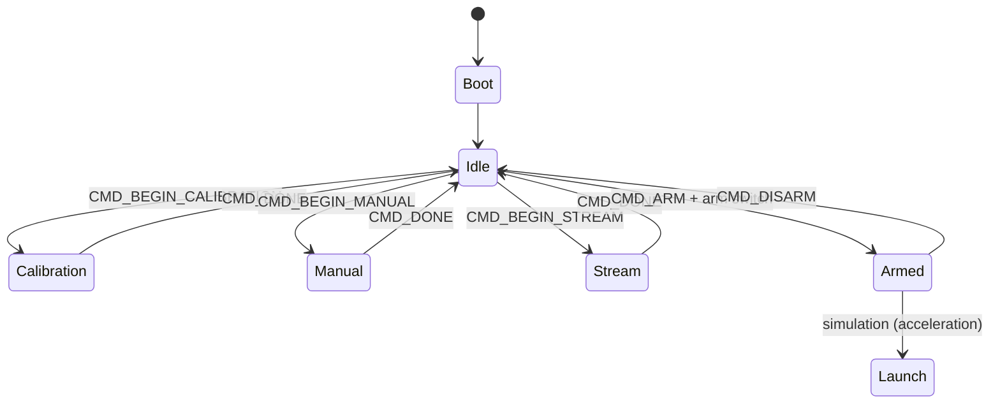

# AsterICS

The AsterICS is the main flight controller. Its functionality may be summed up with this automata:

## State description

All states must provide visual feedback via ledring

- **Boot**
    - (Zephyr Boot).
    - Load parameters from memory.

- **Idle**
    - Listen for commands.

- **Calibration**
    - Calibrate sensors and/or actuators.

- **Manual**
    - Wiggle actuators.
    - Burn pyrocharges.

- **Stream**
    - Enable serial streaming of sensor data.

- **Armed**
    - Ready to launch!

- **Launch**:
    - 🚀

