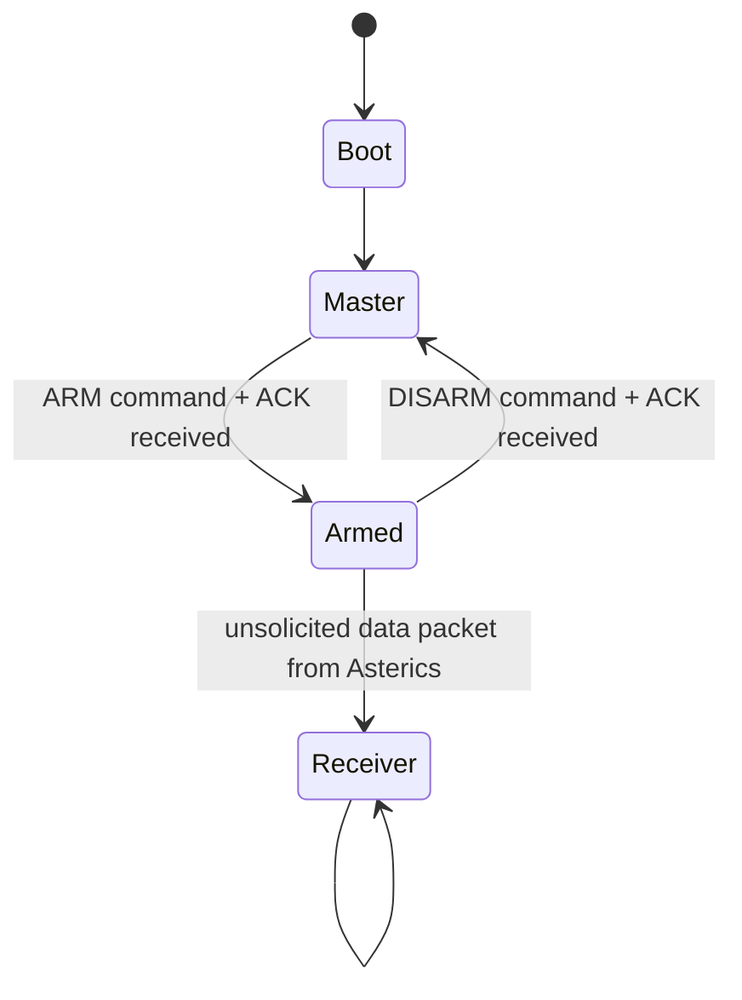

# Obelix

Obelix is the ground system for the RedAster project, made to run with the on board software of the AsterICS.
Idefix is the name for the "server" (Raspberry PI) connected to Obelix via ethernet.

It can be described with this automata:


## State Description

All states have audio and/or visual feedback. All MAVLink packets (TX and RX) are logged.

### Boot
- Zephyr boot and parameter loading
- Initialize all peripherals (LoRa, Ethernet, SD card, audio, buttons)
- Transition to Master automatically after initialization

### Master (Default State)
- **LoRa TX**: Send MAVLink commands to Asterics (user-selected via encoder/button or received from Idefix)
- **LoRa RX**: Receive MAVLink responses/ACKs from Asterics
- **UDP RX**: Receive MAVLink packets from Idefix via Ethernet
- **UDP TX**: Forward packets received from Asterics via LoRa to Idefix.
- **Logging**: Log all TX commands and RX responses
- **Input**: Any MAVLink command allowed.
- **Transitions**:
  - → Armed: When ARM command sent AND ACK received from Asterics

### Armed
- **LoRa TX**: Only ARM (re-confirm) or DISARM allowed; other commands dropped/ignored
- **LoRa RX**: Listen for unsolicited data packets from Asterics
- **UDP TX**: Forward received packets to Idefix
- **Logging**: Log all TX commands and RX packets
- **Input**: Only ARM (re-confirm) or DISARM allowed
- **Transitions**:
  - → Master: When DISARM command sent AND ACK received
  - → Receiver: When unsolicited data packet received from Asterics

### Receiver
- **LoRa RX**: Continuous stream of data packets from Asterics
- **UDP TX**: Forward received data to Idefix via Ethernet
- **Tracking**: Execute tracking algorithm with received data
  - Input: speed (x,y,z), position (lat,lon,alt), timestamp
  - Output: servo angles for pan/tilt control
- **Logging**: Log all received packets and tracking data
- **Input**: DISABLED - no user input accepted
- **Transitions**:
  - None - stays in Receiver indefinitely

## Communication Architecture

```
Obelics (Ground Station)
    │
    ├── LoRa MAVLink ──────────────► Asterics (Flight Controller)
    │   (Commands: ARM, Calibrate, Do)
    │   (Responses: ACK, telemetry data)
    │
    └── Ethernet UDP MAVLink ◄────► Idefix
        (Forward all packets both directions)
```

## Log Format

```
TIMESTAMP_MS,MARKER,DATA
```

Examples:
```
12345678,STATE,BOOT
12345679,STATE,MASTER
12345680,TX,MAV_MSG_COMMAND_LONG:CMD=ARM
12345681,RX,MAV_MSG_COMMAND_ACK:CMD=ARM RESULT=ACCEPTED
12345682,STATE,ARMED
12345683,RX,MAV_MSG_GLOBAL_POSITION:LAT=452123456,LON=12345678,ALT=1000
12345684,TRK,PAN=45,TILT=-10
12345685,STATE,RECEIVER
```

Markers:
- `STATE` - State machine transitions
- `TX` - MAVLink messages sent to Asterics
- `RX` - MAVLink messages received from Asterics
- `TRK` - Tracking algorithm output

## Notes
- All packets from Obelix (LoRa TX) and from ground station (UDP RX) should be logged.
- All packets from Asterics (LoRa RX) should be logged and forwarded to ground station.
- Receiver mode has no exit - once entered, stays indefinitely.
