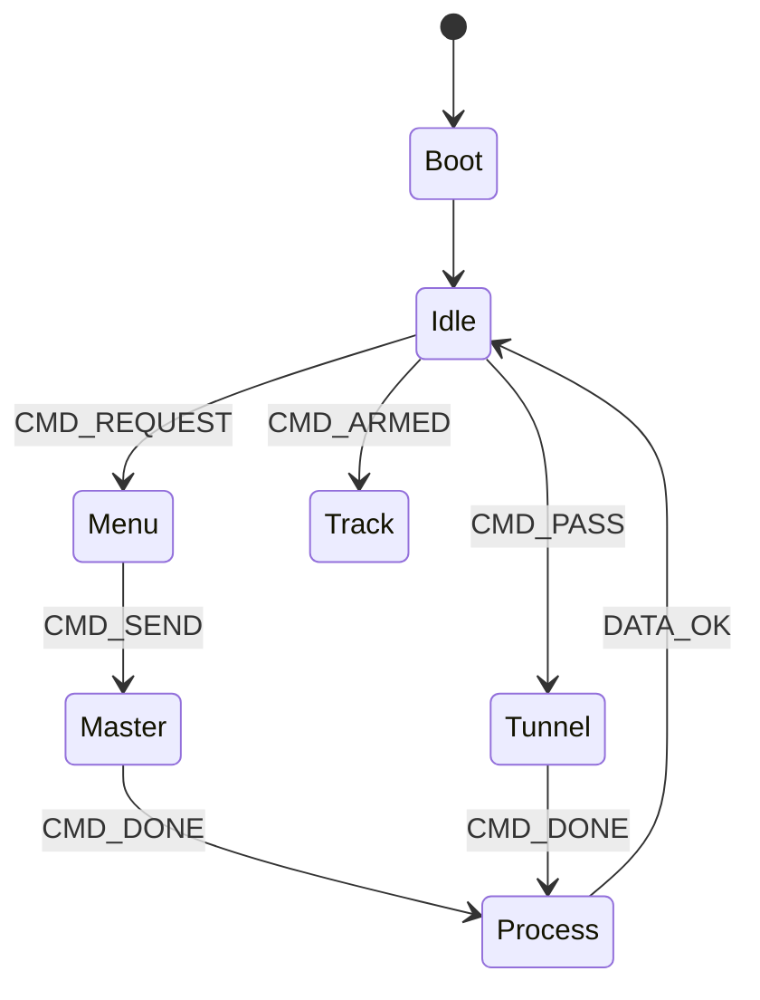

# Obelix
Obelix is the ground system for the RedAster project, made to run with the on board software of the AsterICS

It can be described with this automata:

## State Description
All states will have audio and/or visual feedback or stat tracking.

### Boot
Zephyr Boot + loading parameters

### Idle
listen for manual input or Ethernet packets

### Menu
Select and send commands "Manually" from obelix

### Master
Send commands from Obelix.

### Tunnel
Forward to Asterics commands received from Idefix

### Process
Process data from Asterics and forward to Idedfix

### Track
Listen for packets coming from AsterICS, run the tracking alghoritm to keep data flow from the rocket, forward data to Idefix

## Notes
all packets and commands, from Obelix or Idefix should be logged. All packets from Asterics will be processed on obelix for fallback but also forwarded to Idefix.
