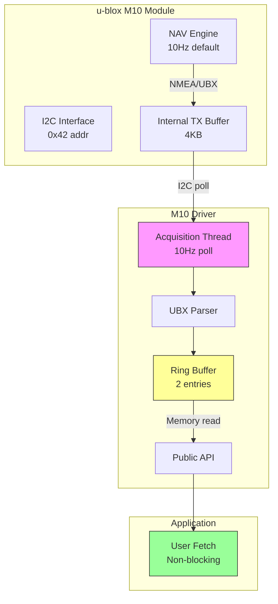
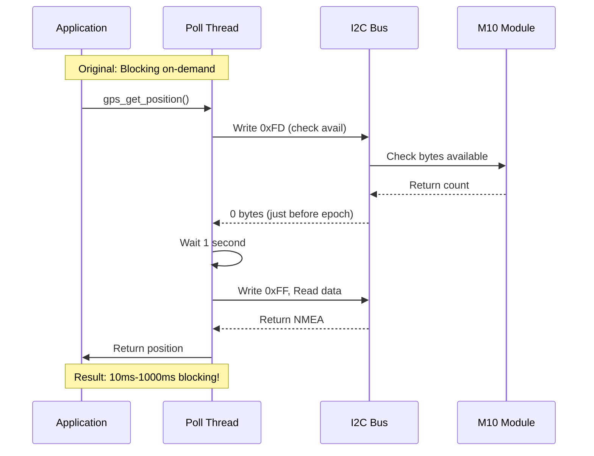
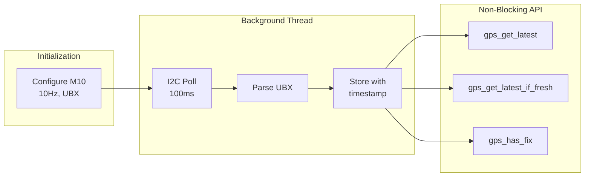
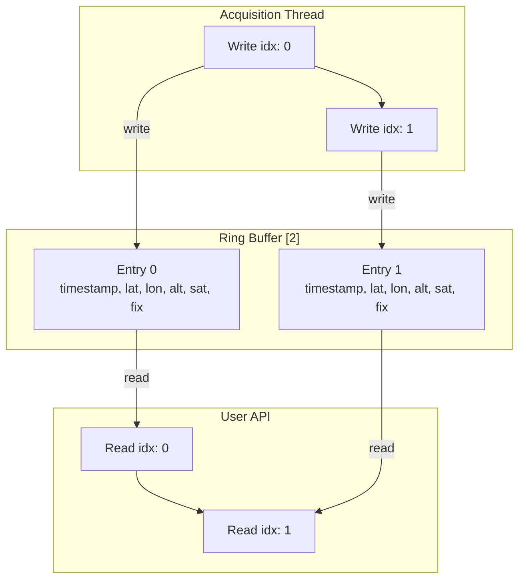

# u-blox M10 GNSS Driver

A non-blocking I2C driver for the u-blox MAX-M10S GNSS module, designed for AsterICS flight controller and ObelICS ground station.

## Overview

This driver implements a high-performance, non-blocking GPS solution optimized for real-time embedded systems where CPU blocking time must be minimized.



## The Problem

### Original Approach Issues

The initial implementation used a **polling thread** that would:

1. Block for up to **1 second** waiting for position data
2. Parse NMEA sentences character-by-character
3. Call blocking I2C operations on each poll

**Problems encountered:**

| Issue | Impact |
|-------|--------|
| 10ms+ I2C blocking | Too long for flight controller real-time requirements |
| Polling at 1Hz | 1-second latency on position data |
| NMEA parsing | Multiple message types (GGA, RMC, GSV) required more I2C traffic |
| No timestamp | No way to know data age |

### Specific Concerns



### What Didn't Work

1. **On-demand polling**: Blocks up to 1 second waiting for M10 to compute a position
2. **NMEA instead of UBX**: Requires parsing multiple message types, more I2C traffic
3. **RTIO async**: STM32 I2C driver doesn't implement callback API (only RTIO fallback which is still blocking)
4. **DMA-based I2C**: Still blocks on semaphore, just reduces CPU during transfer

## The Solution

### Architecture



### Key Design Decisions

1. **10Hz instead of 1Hz**: Fetcher can read at 2Hz and always get fresh data
2. **UBX-NAV-PVT instead of NMEA**: Single message contains all needed data
3. **Ring buffer with 2 entries**: Producer/consumer pattern, non-blocking
4. **CPU timestamps**: User knows actual data age
5. **Configuration on init**: M10 configured to output exactly what we need

### How It Works

#### 1. Initialization (m10_configure)

On driver init, sends UBX-CFG-VALSET messages to configure M10:

```
+---------------------------+----------------------------------+
| Configuration             | Description                      |
+---------------------------+----------------------------------+
| CFG-RATE-MEAS = 100       | 10Hz measurement rate           |
| CFG-MSGOUT-NAV_PVT_I2C=1  | Enable UBX-NAV-PVT on I2C       |
| CFG-I2COUTPROT_NMEA = 0   | Disable NMEA to reduce traffic  |
+---------------------------+----------------------------------+
```

#### 2. Acquisition Thread

Runs at 10Hz (100ms interval), non-blocking I2C operations:

```c
while (1) {
    k_sleep(K_MSEC(100));  // 10Hz poll
    
    // Step 1: Check available bytes (2 I2C ops, ~50μs total)
    write(0xFD);
    read(avail_buf);  // 2 bytes: high/low
    
    // Step 2: Read data if available (~3ms for 100 bytes)
    write(0xFF);
    read(data_buf, avail);
    
    // Step 3: Parse UBX-NAV-PVT
    // Step 4: Store in ring buffer with CPU timestamp
}
```

**Timing breakdown:**

| Operation | Time |
|-----------|------|
| Check bytes available | ~50μs |
| Read ~100 bytes data | ~2.5ms |
| Parse UBX | ~50μs |
| **Total per poll** | **~3ms** |

At 100ms interval: **3% CPU usage**

#### 3. Ring Buffer



Simple 2-entry ring buffer:
- Writer increments write_idx atomically
- Reader reads from current read_idx
- No locks needed - single producer, single consumer

#### 4. Public API

Non-blocking, instant memory reads:

```c
// Get latest position (instant, ~10μs)
struct gps_position pos;
gps_get_latest(&pos);

// Get if data is fresh (check age)
int ret = gps_get_latest_if_fresh(&pos, 500);  // max 500ms old

// Check fix status
if (gps_has_fix()) { ... }

// Get satellite count
uint8_t sats = gps_get_satellites();
```

## Data Structure

```c
struct gps_position {
    uint32_t cpu_timestamp_us;  // When data was captured
    int32_t latitude;            // 1e-7 degrees
    int32_t longitude;          // 1e-7 degrees  
    int32_t altitude_mm;        // mm above MSL
    uint8_t fix_type;          // 0=none, 2=2D, 3=3D
    uint8_t satellites;         // number of satellites
    uint16_t hdop;              // horizontal DOP * 100
    bool valid;                 // data is valid
};
```

## Integration

### Device Tree

```dts
&i2c1 {
    status = "okay";
    gps: gps@42 {
        compatible = "u-blox,m10";
        reg = <0x42>;  /* 8-bit I2C address */
        label = "GPS";
    };
};
```

### Build Configuration (prj.conf)

```kconfig
# GNSS
CONFIG_GNSS=y
CONFIG_GNSS_U_BLOX_M10=y

# I2C
CONFIG_I2C=y
CONFIG_I2C_STM32=y

# Optional: Enable DMA for I2C (reduces CPU during transfer)
CONFIG_I2C_STM32_V2_DMA=y
CONFIG_DMA=y
```

### Using the Driver

Include the public header:

```c
#include "panoramix/drivers/gnss/gps.h"

// In your application code:
void update_position(void)
{
    struct gps_position pos;
    
    if (gps_get_latest_if_fresh(&pos, 500) == 0) {
        // Convert from 1e-7 degrees to degrees
        double lat_deg = pos.latitude / 10000000.0;
        double lon_deg = pos.longitude / 10000000.0;
        
        // Altitude in meters
        double alt_m = pos.altitude_mm / 1000.0;
        
        printf("Position: %.6f, %.6f, %.1fm\n", lat_deg, lon_deg, alt_m);
        printf("Satellites: %u, Fix: %u\n", pos.satellites, pos.fix_type);
    }
}
```

## Files

| File | Purpose |
|------|---------|
| `gnss_u_blox_m10.c` | Main driver implementation |
| `gnss_u_blox_m10_i2c.h` | I2C transport layer header |
| `gnss_u_blox_m10_i2c.c` | I2C transport layer implementation |
| `gps.h` | Public API header |
| `CMakeLists.txt` | Build configuration |
| `Kconfig` | Kconfig options |

## Trade-offs and Limitations

### Current Limitations

1. **No interrupt pin support**: M10 doesn't expose hardware interrupt for position ready
2. **Simple ring buffer**: No overwriting - if consumer doesn't read, data is lost
3. **Single message type**: Only UBX-NAV-PVT, no satellite-level detail
4. **No UBX acknowledgment**: Configuration messages don't check for ACK

### What Could Be Improved

1. **Faster polling**: Could reduce to 50ms for lower latency
2. **More buffer entries**: Increase from 2 to 5 for safety
3. **Satellite detail**: Parse UBX-NAV-SAT for per-satellite info
4. **UBX-ACK check**: Verify configuration was accepted

## Comparison

| Metric | Original (NMEA) | New (UBX) |
|--------|-----------------|-----------|
| I2C transactions per poll | 4+ (GGA+RMC+...) | 4 (avail+data) |
| Data per poll | ~200 bytes | ~100 bytes |
| Blocking time | 10ms | 3ms |
| Update rate | 1Hz | 10Hz |
| Latency | 0-1000ms | 0-100ms |
| CPU timestamp | No | Yes |

## References

- [u-blox M10 Interface Description](https://content.u-blox.com/sites/default/files/documents/u-blox-M10-SPG-5.20_InterfaceDescription_UBXDOC-304424225-20128.pdf)
- [Zephyr GNSS Driver API](https://docs.zephyrproject.org/latest/hardware/peripherals/gnss.html)
- [UBX Protocol Specification](https://portal.u-blox.com/s/document/ubx-protocol-specification)