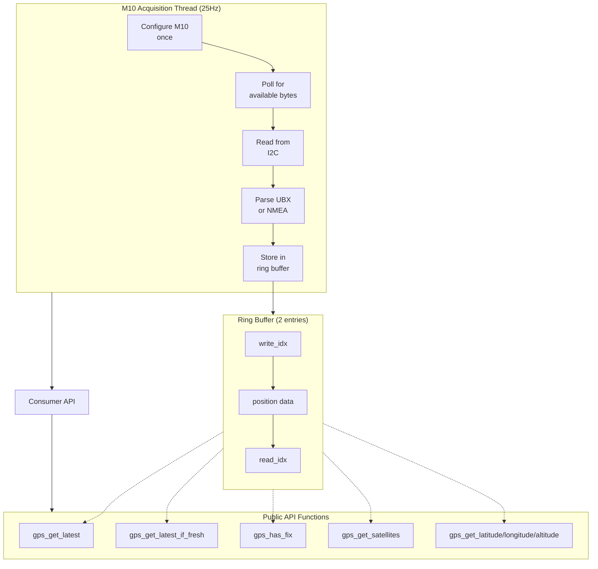
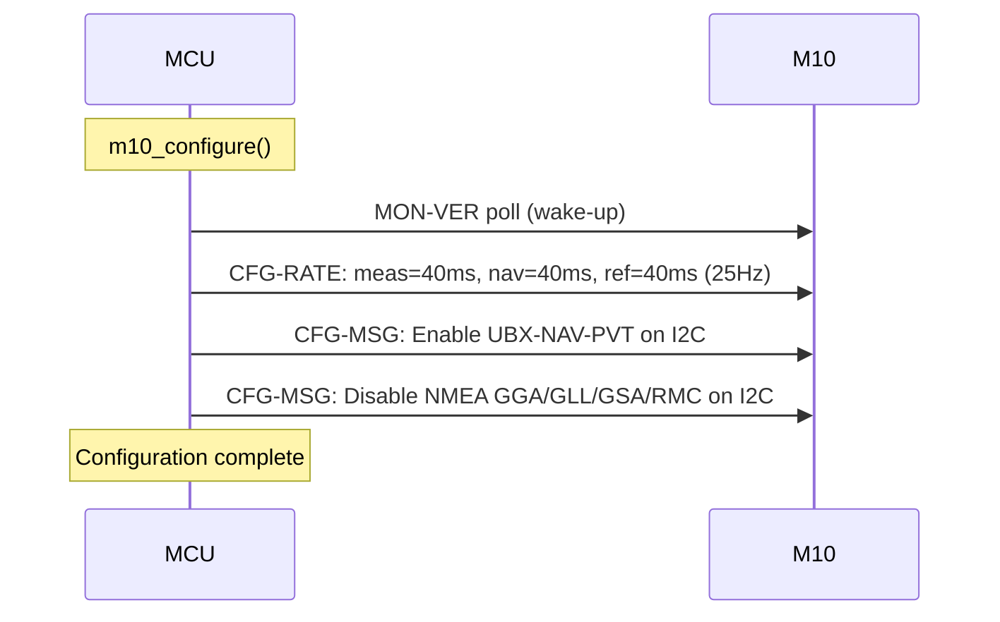
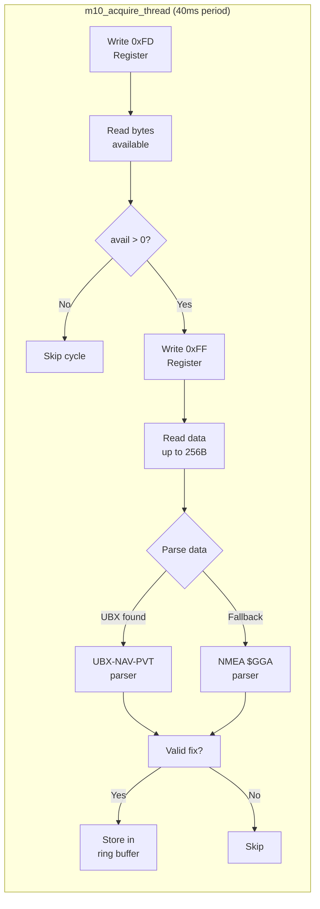
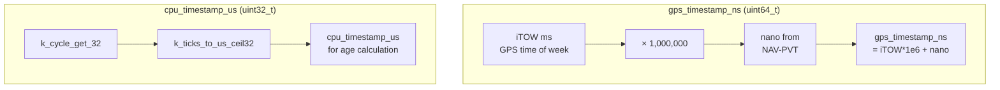
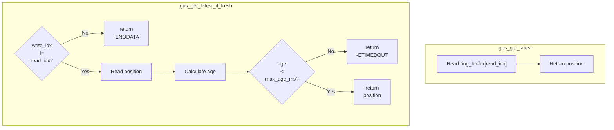
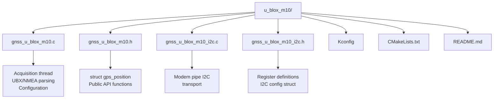

# u-blox M10 GNSS Driver

Driver for u-blox MAX-M10S GNSS module over I2C. Supports UBX-NAV-PVT messages at 25Hz with dual timestamps (GPS nanosecond-precise + CPU microsecond).

## Hardware Connection

| Signal | Pin   | Notes |
|--------|-------|-------|
| SCL     | PF1   | I2C2  |
| SDA     | PF0   | I2C2  |
| VCC     | 3.3V  |       |
| GND     | GND   |       |

- I2C Address: **0x42** (7-bit)
- Protocol: UBX binary + NMEA fallback

## Architecture Overview



## Data Flow

### 1. Configuration Phase (Runs Once)



### 2. Data Acquisition Phase (25Hz Loop)



### 3. Dual Timestamps



Each position includes two timestamps for different purposes:

| Timestamp | Purpose | Calculation |
|-----------|---------|-------------|
| `gps_timestamp_ns` | Precise sync with external systems | `iTOW * 1,000,000 + nano` |
| `cpu_timestamp_us` | Data freshness check | `k_ticks_to_us_ceil32(k_cycle_get_32())` |

### 4. Consumer API Flow



Both functions access the same ring buffer - `gps_get_latest()` is non-blocking (may return stale data), while `gps_get_latest_if_fresh()` validates data age before returning.

## File Structure



## Configuration

### Device Tree (nucleo_h723zg.overlay)

```dts
&i2c2 {
    status = "okay";
    pinctrl-0 = <&i2c2_scl_pf1 &i2c2_sda_pf0>;
    clock-frequency = <I2C_BITRATE_FAST>;  // 400kHz

    gps: gps@42 {
        compatible = "u-blox,m10";
        reg = <0x42>;
    };
};
```

### Kconfig

```
CONFIG_GNSS=y
CONFIG_GNSS_U_BLOX_M10=y
CONFIG_GNSS_LOG_LEVEL_DBG=y  # Optional: debug output
```

### DMA (Currently Disabled)

I2C DMA on STM32H723 has compatibility issues. The driver works with blocking I2C:

```
# In prj.conf - DMA disabled (default)
# CONFIG_I2C_STM32_V2_DMA is not set
```

## UBX Message Format

### NAV-PVT (0x01 0x07) - Position, Velocity, Time

```
Offset  Size  Description
------  ----  -----------
+0      1     Sync1 (0xB5)
+1      1     Sync2 (0x62)
+2      1     Class  (0x01 = NAV)
+3      1     ID     (0x07 = PVT)
+4      2     Length (LE uint16, 92 bytes)
+6     92     Payload (see below)
+98     1     CK_A (checksum A)
+99     1     CK_B (checksum B)
```

### Payload Structure (from Zephyr's `ubx_nav_pvt`)

```c
struct ubx_nav_pvt {
    struct {
        uint32_t itow;      // GPS time of week (ms)
        uint16_t year;
        uint8_t month;
        uint8_t day;
        uint8_t hour;
        uint8_t minute;
        uint8_t second;
        uint8_t valid;
        uint32_t tacc;
        int32_t nano;       // nanoseconds (can be negative)
    } time;

    uint8_t fix_type;       // 0=none, 1=DR, 2=2D, 3=3D
    uint8_t flags;
    uint8_t flags2;

    struct {
        uint8_t num_sv;
        int32_t longitude;  // 1e-7 degrees
        int32_t latitude;   // 1e-7 degrees
        int32_t height;     // mm (ellipsoid)
        int32_t hmsl;       // mm (mean sea level)
        uint32_t horiz_acc; // mm
        uint32_t vert_acc;  // mm
        int32_t ground_speed;   // mm/s
        int32_t head_motion;   // 1e-5 degrees
    } nav;
} __packed;
```

## GPS Fix Types

| Value | Meaning | Description |
|-------|---------|-------------|
| 0 | No fix | No position available |
| 1 | Dead reckoning | Inertial-only, no GPS |
| 2 | 2D fix | Latitude + longitude, no altitude |
| 3 | 3D fix | Full position (valid for time) |

A position is considered **valid** when:

```c
pos.valid = (fix_type >= 3) && (flags & UBX_NAV_PVT_FLAGS_GNSS_FIX_OK);
```

## Error Handling

| Error Type | Behavior |
|------------|----------|
| I2C errors | Logged and skipped, thread continues polling |
| Configuration failures | Retried up to 5 times, then skipped |
| Parse failures | Return -EINVAL, try other parser |
| No data | When bytes available = 0, skip and retry next cycle |

## Timing Considerations

The driver runs at 25Hz (40ms period). Without debug logging, timing may be too tight for the M10 to prepare data. Adding small delays between I2C operations improves reliability:

```c
k_sleep(K_MSEC(1));  // After writing register, before reading
```

## Testing

```bash
# Build
west build -p always panoramix/apps/obelics

# Flash
west flash

# Monitor
west attach
```

Expected output (with fix):
```
GPS: 17/05/2026 14:32:15.123 | lat=437744682, lon=112862637, alt=72000mm | sats=8, fix=3, hdop=15 | speed=0mm/s, heading=0.00000 | gps_ns=..., cpu_us=...
```